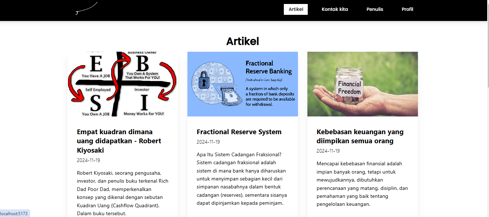
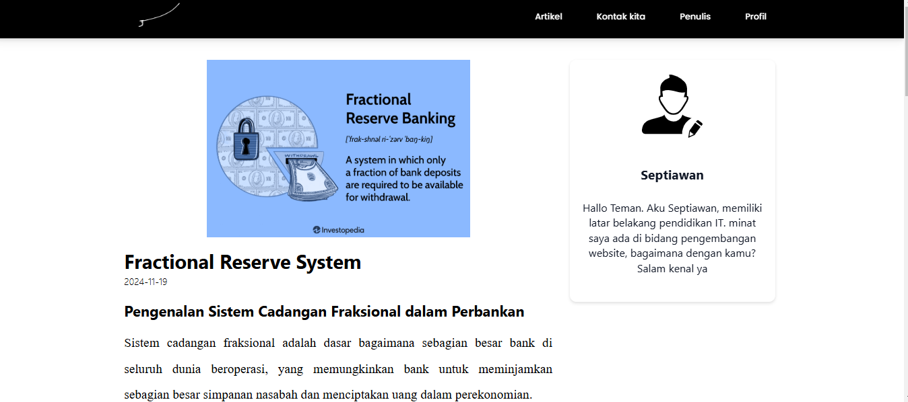
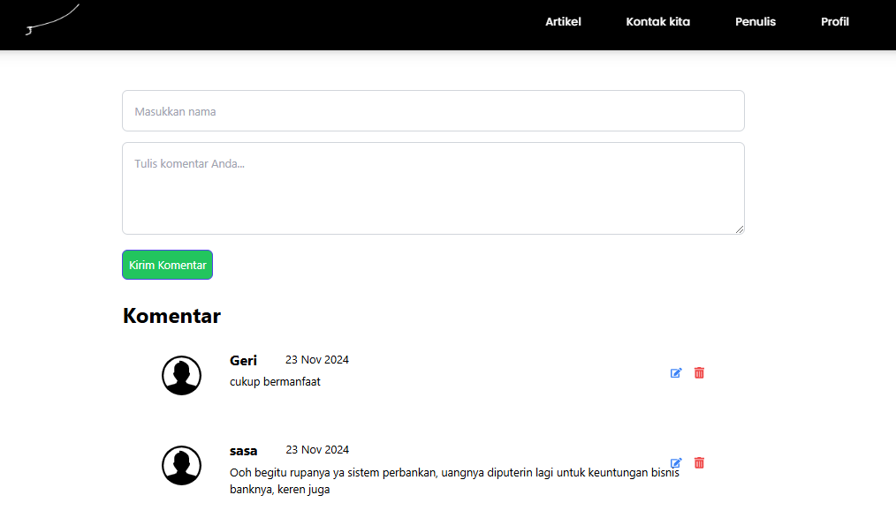
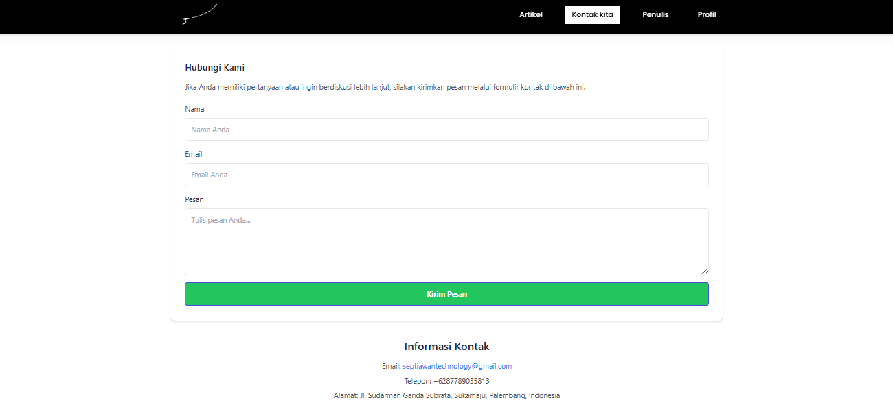
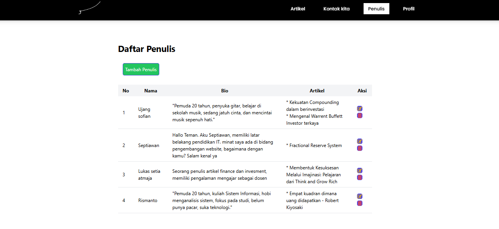
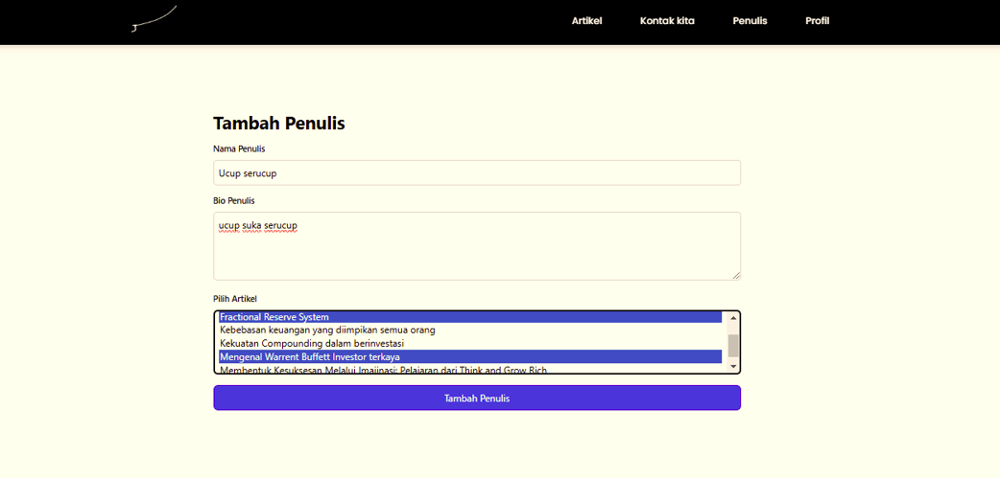
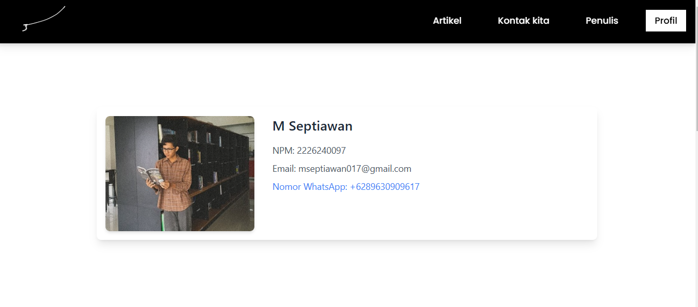
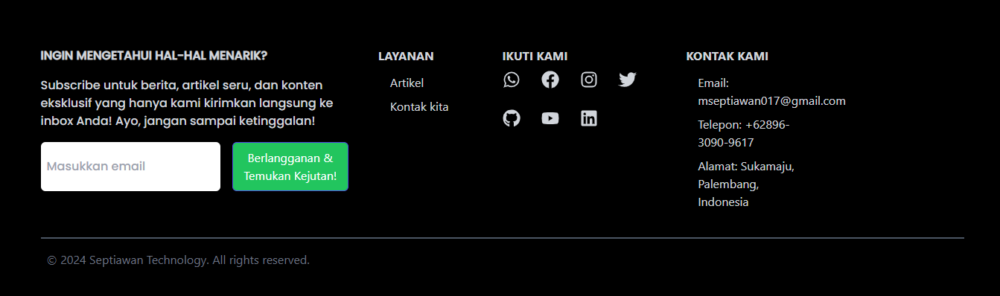

# Blog Finansial and Invesment

Proyek ini merupakan sebuah blog yang membahas tentang kecerdasan finance dan invesment.
Sebuah blog yang sederhana pastinya, namun memberikan pengetahuan yang luas tentang dunia finance dan invesment. anda bisa kunjungi website blog yang telah deploy melalui link berikut: https://blog.septiawantechnology.com

## Fitur

- Tambah dan Edit Penulis
- Tampilan Profil Pengembang
- Tampilan kontak yang terintegrasi dengan emailjs
- Integrasi dengan API untuk mengambil dan mengirimkan data
- CRUD Author
- CRUD Comment
- Relasi Artikel dengan Penulis (many to one)
- Relasi Komentar dengan Artikel (many to one)

## Teknologi yang Digunakan

- React
- Axios
- Tailwind CSS
- React Router
- Strapi

## Prasyarat

Sebelum memulai, pastikan Anda memiliki hal berikut di sistem Anda:

- Node.js (v14.x atau yang lebih baru)
- disarankan untuk melakukan restore data yang telah di backup ini linknya https://drive.google.com/drive/folders/1XVLtFD38h1YoVgXF2OJBP7uLzrX2LMqK?usp=sharing
- menjalankan server apache
- npm atau yarn (untuk manajemen dependensi)

## Instalasi

Ikuti langkah-langkah berikut untuk memulai:

1. git clone
2. atur konfigurasi yang sesuai
3. untuk menjalankan server strapi anda bisa ketik npm run develop
4. dan menjalankan react dengan perintah npm run dev

## Capture blog layar lebar

1. Tampilan awal
   
2. Detail blog
   
3. Komentar
   
4. Kontak kami
   
5. Penulis
   
6. Tambah penulis dan update  
   
7. Profil
   
8. Footer
   

## Capture blog layar kecil

1. Tampilan awal
   .png>)
2. Detail blog
    (1).png>)
3. Komentar
    (1).png>)
4. Kontak kami
    (3).png>)
5. Penulis
   .png>)
6. Tambah penulis dan update  
    (5).png>)
7. Profil
    (4).png>)
8. Footer
    (2).png>)
